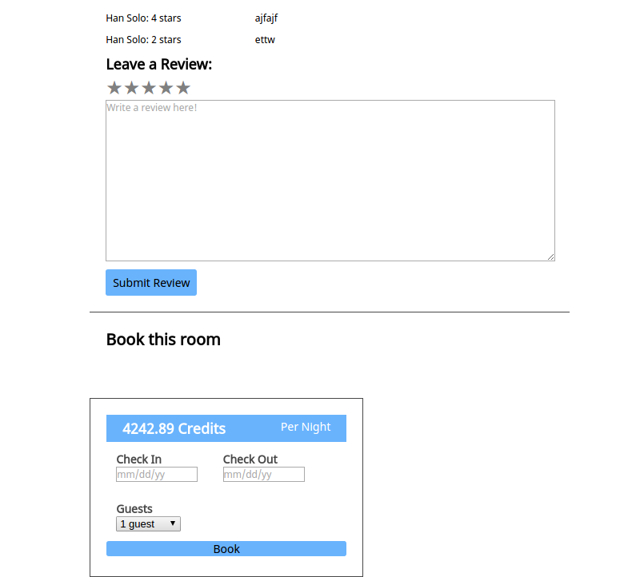

# Air2d2 (inspired by AirBnb but with a Star Wars theme!)

Air2d2 is a Star Wars-themed website inspired by AirBnB, specifically its UX design. This full-stack web application uses Ruby on Rails on the backend and React.js/Redux on the frontend. I used PostgresSQL to store my seed data and CSS/SASS to style the website. I picked blue and white for the Star Wars theme.

You have the option to sign up as a new user, log in as yourself, or log in as a new user. You are able to search for and view rooms. There are featured rooms on the home page that you can quickly choose from. If you sign in, you are able to leave reviews and make and cancel bookings for places that you have stayed at.

## Heroku Link

[Heroku Link](http://air2d2.herokuapp.com)


## Features & Implementation

On the database side, there are main models/tables for users, rooms, reviews, and bookings.

The home screen for Air2d2:


The home page slightly changes when a user logs in by displaying a greeting.

The show page for a room:


Two main features are for users to leave reviews and to book rooms:




Implementing the reviews require all four tables to be in the database. It contained a `user_id`, `room_id`,`booking_id` and its own `id`. When the user types a review and submits it, an API call is made to the database, which checks to make sure that the user made a booking in the past for the room he or she is reviewing. It filters through the bookings table, which joins the user and the room. If the review is valid, the new review will be sent back and rendered immediately on the page without having to refresh the page. Otherwise, a JSON error message is sent back to be rendered.

When a user wants to book a room, an action is dispatched, sent through the thunk middlewhere, which calls an AJAX request to the database. Once it hits the database, it checks to see if the room has been booked for the selected timeframe. If the room is available, then the booking is created and the user will be redirected to all of the user's past and future bookings. If the room is not available, an error message gets sent back in JSON to be rendered on the page. The error messages are also immediately rendered on the page due to the beauty of React/Redux!

## Challenges

I wanted to be DRY (DON'T REPEAT YOURSELF), so I utilized the same AJAX method as well as action method in order to do fetch rooms with search filters AND to fetch rooms without any filters. In order to do that, I had defined the logic inside the `RoomsController` and changed the AJAX request method `fetchRooms` to take in an optional `{data}`.

For example, here is a query method to search by city: `@rooms = Room.all.where("city LIKE ?", "%#{city}%")`.

The action:
    ```export const fetchRooms = filters => dispatch => {
  return(
  RoomUtil.fetchRooms(filters)
    .then(rooms => dispatch(receiveRooms(rooms)))
    )};```


## Search

The website currently supports fuzzy search based on city. In the future, it will use Google's API to autocomplete searches.

## Bonus Features in the Future
- Bonus: Messaging
- Bonus: User/host profiles
